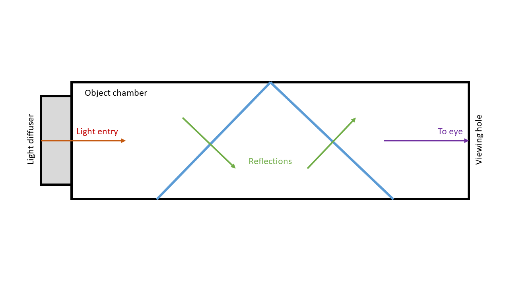

# What is a kaleidoscope?

**A kaleidoscope is a handheld optical device that creates symmetrical and colorful patterns through the reflection of light.**

The device consists of a tube that contains two or more flat mirrors arranged at equal angles, along with colored glass pieces or pebbles placed inside. One end of the tube features a frosted glass or semi-translucent plastic cover, which diffuses the light entering the tube. The opposite end has a small viewing hole.

*Figure 1: Cross-sectional view of a kaleidoscope showing its basic components*

When you look through the viewing hole and rotate the tube, the glass pieces or pebbles shift, producing unique symmetrical patterns. This optical illusion occurs as you see multiple reflections of the same glass piece or pebble at once. The specific angles and placement of the mirrors determine the complexity of the reflected patterns.